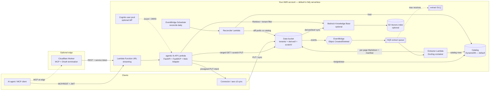

# Agentic File System — open-source, AWS-native (design plan)

> Status: PROPOSED (June 2026). Implemented in this **standalone repository** —
> this doc is the build spec. It is a clean-room design: port the *ideas* from
> prior internal prototypes, not any application-coupled code (an ORM, a specific
> IdP, a cache, a task queue, a web BFF all stay behind).
>
> Working name: **`agentic-fs`** (Python import prefix `afs_`, CLI `afs`).
> "AgentFS" is taken (Turso, 2025) — final name TBD (§16). License: Apache-2.0.

---

## 0. TL;DR

`agentic-fs` gives AI agents **filesystem-style access to an organization's
documents** — `list` / `glob` / `grep` / ranged `read` / semantic `search` —
over documents stored in **your own S3**, exposed through **MCP** (and REST).
It is multi-tenant, deploys into **your AWS account with one `terraform
apply`**, costs **~$2/month idle**, and every stateful layer sits behind a
small contract you can swap (catalog store, object store, search backend,
extractor, ingestion connectors, agent tools).

It is the thin, opinionated layer between S3 and an agent: tenancy, namespacing,
authorization, a catalog, content search, and bounded reads — the parts a raw
"point an MCP server at a bucket" approach can't give you (§1.3).

**One-paragraph architecture.** Documents land in S3 (canonical). S3 events
drive a serverless pipeline that extracts text (Docling) into a derived prefix
and writes a catalog row (DynamoDB by default). An MCP/REST service (Lambda by
default; same image runs on Fargate; optional Cloudflare Worker at the edge)
serves agents: it authorizes each request against an OAuth 2.1 token, narrows it
to the tenant + namespace the caller is allowed to see, and answers with
filesystem primitives. Grep is the floor (works with zero extra infra);
semantic search is an optional Bedrock Knowledge Base on S3 Vectors. The catalog
and all derived data are **rebuildable from S3** — S3 is the only source of
truth.

**Who it's for.** Teams that want Claude-Code-style corpus access for their own
documents, in their own cloud, without handing data to a RAG vendor — and who
want to extend it (write a SharePoint connector, swap DynamoDB for Postgres,
add a custom tool) against clean interfaces instead of forking.

---

## 1. Goals, non-goals, positioning

### 1.1 Goals

1. **Bring-your-own-AWS, plug-and-play.** A fresh AWS account → `terraform
   apply` → working MCP endpoint in ~15 minutes, with `aws_region` the only
   required variable.
2. **MCP-first, agent-shaped.** Agents *navigate* a corpus (list/grep/read,
   cross-reference, synthesize) — not one-shot top-k retrieval. Bounded outputs
   and explicit budgets so a 900-page manual never blows the context window.
3. **Multi-tenant and enterprise-secure by default.** Prefix-isolated tenants
   in one bucket, SSE-KMS everywhere, OAuth 2.1 resource server, no-enumeration
   (404-not-403), audit logging — none of it bolted on later.
4. **Pluggable at every layer for cost control.** Best tool as the default,
   every stateful dependency behind a minimal contract with a conformance test
   kit, a per-layer Terraform module, and a per-layer swap guide. Don't want to
   pay for DynamoDB? Swap Postgres. Don't need semantic search? Turn it off; grep
   still works.
5. **Extensible without forking.** Add an MCP tool, a document normalizer, a
   search backend, or an ingestion connector by installing a package that
   implements a contract — no changes to the core.

### 1.2 Non-goals (v1) — see §15 for the full list with rationale

No per-document ACLs (namespace + prefix granularity only), no agent writes to
canonical corpora (read-only by construction; scratch space is the only write
surface), no UI/console, no protobuf/gRPC, no in-tree SharePoint/GDrive
connectors (we ship the contract + SDK + one reference connector), no own vector
store or chunker (Bedrock KB owns that), no shared cache tier, no billing.

### 1.3 Positioning — why this exists

| Alternative | What it is | Why `agentic-fs` differs |
|---|---|---|
| **"Point an MCP server at an S3 bucket"** (off-the-shelf S3/filesystem MCP servers) | A generic FS server over a bucket | Has no per-tenant gating (AWS creds authenticate the whole bucket), no content search (`ListObjects` + `GetObject` whole files → O(corpus) tokens per question), and no catalog/bounded reads (keys aren't titles/versions/entities). `agentic-fs` **is** "MCP against S3" plus exactly those three things — the only things worth building. |
| **Turso AgentFS** (2025) | Local, SQLite-backed POSIX-ish FS + KV for a single agent's working state | Local & agent-memory-shaped; `agentic-fs` is cloud-hosted, **document-corpus**-shaped, multi-tenant, S3-backed. |
| **Managed RAG platforms** (Ragie, Onyx, Glean, LlamaCloud) | Closed, hosted RAG-as-a-service | Vendor in your data path, per-usage fees, chunk-retrieval-shaped (not navigation-shaped). `agentic-fs` is OSS, self-hosted in your account, S3-native, navigation-first with retrieval as an option. |
| **Sandbox platforms** (E2B, Daytona, Modal) | Ephemeral compute/filesystem for running agent code | Solve code execution, not document corpora over your storage. Complementary, not competing. |

The industry has converged on **agentic grep/read over indexed RAG** for
insight-style work: Anthropic removed vector search from Claude Code in favor of
grep; Amazon Science (Feb 2026) measured agentic keyword search at ≈ RAG-level
quality with no vector DB; Cursor uses semantic search only as a *supplement* to
structural search. `agentic-fs` bakes that consensus in: **grep is the floor,
search is an accelerator you switch on when corpora outgrow it.**

References: [Anthropic — effective context engineering](https://www.anthropic.com/engineering/effective-context-engineering-for-ai-agents),
[Mintlify — virtual filesystem for their assistant](https://www.mintlify.com/blog/how-we-built-a-virtual-filesystem-for-our-assistant),
[Claude Code grep-over-indexing](https://vadim.blog/claude-code-no-indexing/),
[Anthropic — code execution with MCP](https://www.anthropic.com/engineering/code-execution-with-mcp).

---

## 2. Architecture

### 2.1 Principles (the load-bearing ones)

- **S3 is canonical; everything else is derived and healable from it.** The
  catalog, extracted text, path-tree artifacts, and vector index are all
  rebuildable by replaying S3. Lose any of them → a reconciliation sweep
  restores it. This is the single most important property; every design choice
  defers to it.
- **Clients request, claims authorize.** A request can only *narrow* (which
  namespaces, which entity/prefix); it can never widen what the token allows.
  Narrowing-only is the same trust model whether it comes from a page, a tool
  argument, or an MCP connection URL.
- **Grep is the floor; search backends are accelerators.** Lexical/structural
  access always works with zero extra infrastructure. Configuring a semantic
  backend is an upgrade, not a dependency.
- **Bounded outputs, always.** Reads are page-ranged, grep returns match
  windows + counts, lists are clamped, and the remaining budget is surfaced to
  the agent so it can self-correct.
- **Catalog-only degradation.** A document we can't extract is *listed with
  metadata and is cite-able* ("this exists, I can't read its contents yet") —
  never silently absent.
- **Read-only corpora by construction.** Agents never mutate canonical
  documents; the only write surface is an opt-in per-principal **scratch**
  namespace (quota + TTL, never indexed into corpora).
- **Every stateful layer behind a contract.** Minimal `Protocol`, proven by a
  conformance test kit, one Terraform module, one swap guide.
- **Declared policy, projected into tests.** Every route declares its required
  scopes or fails at import; the OpenAPI schema carries `x-required-scopes` /
  `x-mcp-tool`; a contract test asserts coverage. (The lightweight OSS port of
  the prior prototype's declared-authz discipline.)

### 2.2 Component diagram



### 2.3 Three flows

- **Ingest:** `POST /v1/ingest/{ns}/uploads` → presigned PUT (or `aws s3
  sync`) → `ObjectCreated` → EventBridge → SQS → extractor (Docling →
  per-page Markdown in `derived/text/` + page-map manifest) → catalog row →
  (optional) Knowledge Base sync.
- **Serve:** agent calls an MCP tool / REST endpoint with a JWT → authorize +
  narrow to `(tenant, namespace, prefix)` → catalog query / ranged S3 read /
  two-stage grep / semantic Retrieve → bounded, cited response.
- **Heal:** EventBridge Scheduler → reconciler diffs each tenant prefix against
  the catalog **both ways** — catalog missing objects, tombstone orphaned rows,
  re-extract on checksum drift, rebuild stale path-tree artifacts. This *is* the
  "rebuildable from S3" guarantee, exercised on a schedule.

### 2.4 Repo layout

Monorepo, **uv workspace**, **three distributable Python packages** (the floor
and the ceiling — connectors must install without the server; conformance kits
must import without the server):

```
agentic-fs/
├── README.md                 # the quickstart IS the readme (§13)
├── LICENSE                   # Apache-2.0
├── AGENTS.md                 # repo conventions for coding agents
├── Makefile                  # single entry point for every dev task
├── docker-compose.yml        # MinIO + DynamoDB Local + api + worker (+ postgres profile)
├── pyproject.toml            # uv workspace root; shared ruff/ty/pytest config
├── .pre-commit-config.yaml
├── .github/workflows/        # lint, test, conformance, drift, terraform, e2e, release
├── packages/
│   ├── afs-core/             # CONTRACTS. Deps: pydantic only
│   │   └── src/afs_core/
│   │       ├── contracts/    # catalog.py objects.py search.py normalize.py connector.py tools.py
│   │       ├── models/       # CatalogEntry, NamespaceRecord, Principal, Page[T], GrepResult…
│   │       ├── events/v1.py  # versioned event contracts (§9)
│   │       ├── keys.py       # the ONE definition of the key scheme + is_indexable()
│   │       ├── errors.py     # closed error-code vocabulary + AfsError hierarchy
│   │       └── testing/      # conformance kits + in-memory fakes
│   ├── afs-server/           # the service. Deps: afs-core, fastapi, fastmcp>=3, boto3
│   │   ├── scripts/export_openapi.py        # no-live-services schema export
│   │   ├── scripts/export_event_schemas.py
│   │   └── src/afs_server/
│   │       ├── main.py       # ASGI assembly: REST + FastMCP mount (Web-Adapter compatible)
│   │       ├── settings.py   # pydantic-settings; AFS_* env vars
│   │       ├── authn/        # JWKS resource server, RFC 9728 PRM, dev static keys
│   │       ├── api/          # SecuredRouter + routers (fs, scratch, ingest, control, meta)
│   │       ├── mcp/          # server.py, middleware.py, context.py, tools/builtin.py
│   │       ├── services/     # enforcement, fs, scratch, ingest, control, tree, grep
│   │       ├── stores/       # catalog_dynamodb.py, catalog_postgres.py, objects_s3.py
│   │       ├── search/       # bedrock_kb.py
│   │       ├── extraction/   # pipeline.py + rungs/{text_native,docling,llamaparse}.py
│   │       ├── workers/      # handler.py (Lambda entry) + cataloger, extractor, index_sync, reconciler
│   │       └── plugins.py    # entry-point loading: afs.tools / afs.normalizers / afs.search_backends / afs.catalog_stores
│   └── afs-connector-sdk/    # Deps: afs-core, httpx. NO server deps.
│       └── src/afs_connector_sdk/   # IngestClient, BaseConnector, ConnectorRunner, CLI
├── workers/mcp-edge/         # optional TS Cloudflare Worker (§7)
│   └── src/{index.ts, auth.ts, generated/}   # generated client + tools table (committed)
├── schemas/
│   ├── openapi.json          # committed, drift-gated
│   └── events/v1/*.schema.json
├── terraform/
│   ├── modules/              # §11
│   ├── examples/{quickstart,hardened,full,byo-postgres}/
│   └── global/ci-roles/
├── docs/                     # §13
├── examples/
│   ├── corpus/               # tiny demo corpus (incl. one catalog-only binary)
│   ├── connectors/fs-crawler/   # reference connector (uses only afs-connector-sdk)
│   ├── tools/word-count-plugin/ # reference ToolProvider plugin
│   └── clients/{claude-code.md, claude-desktop.md}
└── tests/e2e/                # cross-package tests against docker-compose
```

---

## 3. Storage & key scheme

### 3.1 One bucket, channel-first keys

A **single data bucket** `agentic-fs-data-{account_id}` (a second bucket
doubles every policy/lifecycle/event surface without adding an isolation
boundary — tenancy is prefix-based regardless). Top-level **channel** prefixes:

```
s3://agentic-fs-data-{account_id}/
  tenants/{tenant_id}/{namespace}/{entity?}/{relpath}                  # raw canonical documents
  scratch/{tenant_id}/{principal_id}/{relpath}                         # agent scratch (TTL'd)
  derived/text/{tenant_id}/{ns}/{entity?}/{doc_id}/{page:04d}.md       # extracted text layer
  derived/text/{tenant_id}/{ns}/{entity?}/{doc_id}/{page:04d}.md.metadata.json  # Bedrock KB sidecar
  derived/meta/{tenant_id}/{ns}/{entity?}/{doc_id}/manifest.json       # extraction manifest / page-map
  derived/tree/{tenant_id}/{ns}.json.zst                               # materialized path-tree artifact
```

**Why channel-first** (`derived/text/{tenant}/…`, not `tenants/{tenant}/…/derived/`):

1. Bedrock KB data sources sync from `inclusionPrefixes` (no globs) — the sync
   source must be a prefix containing *only* embeddable text + sidecars →
   `derived/text/`.
2. One EventBridge rule (`prefix: tenants/`) feeds the extract pipeline and
   excludes all derived + scratch writes for free (no feedback loop).
3. Lifecycle rules become plain prefix rules (expire `derived/` noncurrent
   versions; the scratch channel gets its own rule).

Cost: tenant scoping lists 3–4 fixed prefixes instead of 1 — fine for IAM
policies (§4) and trivial for the app, which builds every key through one
module.

### 3.2 `keys.py` owns the scheme

`afs_core/keys.py` is the **single definition** — build, parse, and validate.
Nothing else concatenates a key. It exposes:

- `originals_key(tenant, ns, path)`, `derived_text_key(...)`,
  `derived_meta_key(...)`, `scratch_key(tenant, principal, path)`,
  `tree_key(tenant, ns)`.
- `parse_key(key) -> ParsedKey | None` (None = nonconforming — never guessed).
- `is_indexable(key) -> bool` — the one predicate every consumer (cataloger,
  extractor, index-sync, tree builder, search scope) uses to exclude
  `scratch/` and `derived/`. Never a per-consumer regex.
- Path validation: reject `..`, absolute paths, reserved names (anything
  matching `^_`, the `.derived`/`derived`/`scratch` channel words), and
  scheme-nonconforming relpaths. One code path to test for traversal.

**Namespaces are runtime data** (created via the control API, §6), validated at
**admission time** — the runtime port of the branch's import-time
`validate_namespace_registry`: slug regex, reserved-prefix rejection, and an
optional `entity_segment: bool` flag declaring whether the first path segment is
an entity id (which powers prefix narrowing). Tenants do **not** supply key
templates — arbitrary templates could escape the tenancy prefix; the server owns
the scheme, a namespace only toggles the entity segment.

### 3.3 Bucket configuration

- **Block Public Access**: all four on. **Object Ownership**:
  `BucketOwnerEnforced` (ACLs disabled).
- **Versioning**: on (raw is canonical; protects against deletion bugs).
  Noncurrent expiry: `derived/*` 7 days, `tenants/*` configurable (default 30).
- **Bucket policy**: `Deny` when `aws:SecureTransport=false`; `Deny PutObject`
  unless `s3:x-amz-server-side-encryption = aws:kms`; (GuardDuty module on)
  `Deny GetObject` on objects tagged unscanned/threat except the
  scanner/extractor roles.
- **Encryption**: SSE-KMS with the project CMK, **bucket keys enabled** (cuts
  KMS request cost ~99%). See §4.3 for the per-tenant-key option and the honest
  encryption-context caveat.
- **Lifecycle rules**: `scratch-ttl` (prefix `scratch/` → expire after
  `scratch_ttl_days`, default 7, + remove delete markers); `derived-noncurrent`
  (prefix `derived/` → noncurrent expire 7 days); `raw-tiering` (prefix
  `tenants/` → Intelligent-Tiering; flag to disable for tiny corpora);
  `abort-multipart` (3 days).
- **EventBridge notifications**: enabled (rules do the filtering;
  AWS-service events on the default bus are free).
- **Access logging** (`enable_access_logs`, default off — CloudTrail data
  events in §14 are the better audit story).

> **Swap guide — object store.** Implement `ObjectStore` (§5.2). S3 is the only
> production impl; the protocol exists so MinIO/LocalStack back local dev (same
> impl, `endpoint_url` override) and an in-memory fake backs tests. Certify with
> `ObjectStoreConformance`. There is no Terraform to change unless you point at
> a different bucket.

---

## 4. Tenancy & security

Three layers of defense in depth; only the first is always on.

### 4.1 Layer 1 — application enforcement (always)

Every request carries a verified JWT → resolved to a `TenantContext`
(`tenant_id` + allowed namespaces + scopes). Every S3 key and DynamoDB partition
key is built through `keys.py`; no raw concatenation exists elsewhere. Misses
return **404, never 403** — no tenant/namespace/document enumeration. This is
the floor and is sufficient for the single-trusted-data-plane model the whole
system assumes.

### 4.2 Layer 2 — per-request STS scoping (optional, `enable_session_policy_scoping`)

Off in `quickstart`, on in `examples/hardened`. One standing role
`agentic-fs-tenant-scoped` whose **identity policy is ABAC-shaped** (resources
interpolate `${aws:PrincipalTag/tenant_id}`); the API assumes it per request
with **session tags** (`tenant_id`, optionally `namespace`). Session tags are
fixed-size, dodging the 2048-char inline-policy cap entirely. An inline session
policy is *additionally* passed for entity-level narrowing (intersection
semantics ⇒ can only narrow). Shape:

```json
{
  "Version": "2012-10-17",
  "Statement": [
    {"Sid": "ReadTenant", "Effect": "Allow", "Action": ["s3:GetObject"],
     "Resource": [
       "arn:aws:s3:::agentic-fs-data-123456789012/tenants/${aws:PrincipalTag/tenant_id}/*",
       "arn:aws:s3:::agentic-fs-data-123456789012/derived/text/${aws:PrincipalTag/tenant_id}/*",
       "arn:aws:s3:::agentic-fs-data-123456789012/derived/meta/${aws:PrincipalTag/tenant_id}/*"]},
    {"Sid": "ListTenant", "Effect": "Allow", "Action": "s3:ListBucket",
     "Resource": "arn:aws:s3:::agentic-fs-data-123456789012",
     "Condition": {"StringLike": {"s3:prefix": [
       "tenants/${aws:PrincipalTag/tenant_id}/*",
       "derived/*/${aws:PrincipalTag/tenant_id}/*"]}}},
    {"Sid": "Scratch", "Effect": "Allow", "Action": ["s3:PutObject", "s3:DeleteObject"],
     "Resource": "arn:aws:s3:::agentic-fs-data-123456789012/scratch/${aws:PrincipalTag/tenant_id}/*"},
    {"Sid": "Decrypt", "Effect": "Allow", "Action": "kms:Decrypt",
     "Resource": "arn:aws:kms:*:123456789012:key/<shared-or-tenant-key-id>"}
  ]
}
```

Latency/caching: AssumeRole adds ~50–100 ms → cache credentials in-memory per
`(tenant, namespace-set)` (LRU, 900 s sessions, refresh at 80%). Warm Lambda
containers make the cache effective; steady-state cost is one STS call per cold
tenant per container. An optional DynamoDB statement with a
`dynamodb:LeadingKeys` condition extends the same scoping to the catalog.

### 4.3 Layer 3 — KMS

Default = **shared CMK**. Honest caveat to document: SSE-KMS sets its *own*
encryption context (the object ARN), and with bucket keys enabled the context is
the *bucket* ARN — so per-tenant cryptographic isolation comes from **which key
encrypts**, not from a per-prefix context condition. Therefore the per-tenant
crypto option is **`per_tenant_kms`** (premium): objects written with a
tenant-specific key id; the session policy grants `kms:Decrypt` only on that
tenant's key ARN. v1 ships the key-policy *template* + the app-side `tenant →
key_id` seam; automated key-fleet lifecycle (create-on-onboard) is deferred —
key churn follows tenant churn, which is control-plane-shaped, not Terraform-shaped.

### 4.4 S3 Access Grants — evaluated, rejected for v1 (ADR)

Access Grants solves the same problem as session policies (vended prefix-scoped
credentials) but adds a regional Grants instance, location registration, grant
CRUD churn per tenant (+ quotas), `GetDataAccess` latency, and a second
authority to audit — with zero benefit while a single trusted data plane brokers
all access. Its sweet spot is *direct-to-S3* access for customer-held
identities (Identity Center), which is not our model. Record as
`docs/decisions/no-s3-access-grants.md`; revisit only if direct-to-S3 lands on
the roadmap.

### 4.5 AuthN — OAuth 2.1 resource server, OIDC-agnostic

The service is a **pure resource server** (it never issues tokens). It verifies
bearer JWTs via JWKS, checks `iss` + `aud` (the MCP resource URI, per RFC 8707
resource indicators), and serves `/.well-known/oauth-protected-resource` (RFC
9728) so MCP clients discover the authorization server. Bring any OIDC IdP
(Cognito, Auth0, WorkOS, Okta, Keycloak…). Scopes:

| Scope | Grants |
|---|---|
| `fs:read` | list / glob / grep / read / stat / tree |
| `fs:search` | semantic search |
| `fs:write:scratch` | scratch read/write/delete |
| `ingest` | upload intents, batch, delete, metadata, connector checkpoints |
| `admin` | tenant / namespace / principal CRUD, apply, reconcile |

Optional **`auth_cognito` Terraform module** provides batteries-included OAuth
(user pool + resource server + scopes + clients) — on in quickstart, $0 under
the free tier. A **dev static-key mode** (`AFS_AUTH_MODE=dev` +
`dev-principals.yaml`) exists for local only and logs a loud warning.

### 4.6 Audit & hardening

- **Per-call structured audit log** (structlog JSON): `tool`/`route`,
  `tenant_id`, `principal_id`, `namespaces`, `bytes_returned`, `budget`,
  `outcome`. Deny-by-default on unknown principals, with an evidence log
  (`mcp_token_unknown_principal`) — hiding is not blocking.
- **Optional CloudTrail S3 data events** (`enable_cloudtrail_data_events`):
  object-level forensics; tenant id is in every key, so audit queries are
  prefix filters.
- **Presigned URL hardening**: 15-min PUT expiry, **server builds every key**
  (the client never supplies a raw key), SSE-KMS headers + `x-amz-checksum-*`
  signed into the URL, HTTPS enforced by bucket policy.

> **Swap guide — IdP.** Point `AFS_OIDC_ISSUER` / `AFS_OIDC_AUDIENCE` at any
> OIDC provider; disable `auth_cognito`. The resource server validates standard
> JWTs — nothing is Cognito-specific.

---

## 5. Contracts & interfaces — the heart

All contracts are `typing.Protocol` (structural — adopters implement without
importing our hierarchy or depending on `afs-server`), **async**, and live in
`afs_core/contracts/`. Each is proven by a **conformance kit** in
`afs_core/testing/`: an abstract pytest class you subclass and point at your
impl. Inheritance is used only there (subclass-to-certify) and for the optional
`BaseConnector` convenience class.

### 5.1 `CatalogStore` (contracts/catalog.py)

One contract covers entries + control records + checkpoints + scratch quota — so
a self-hoster swaps **one** stateful dependency (one DynamoDB table / one
Postgres schema).

```python
class CatalogStore(Protocol):
    # -- entries (derived index of S3; healable FROM S3) --
    async def put_entry(self, entry: CatalogEntry) -> None: ...
    async def get_entry(self, tenant_id: str, namespace: str, path: str) -> CatalogEntry | None: ...
    async def delete_entry(self, tenant_id: str, namespace: str, path: str, *, hard: bool = False) -> None: ...
    async def list_entries(
        self, tenant_id: str, namespace: str, *,
        prefix: str = "", include_deleted: bool = False,
        cursor: str | None = None, limit: int = 1000,
    ) -> Page[CatalogEntry]: ...
    async def find_by_checksum(self, tenant_id: str, checksum: str) -> list[CatalogEntry]: ...
    async def set_extraction(self, tenant_id: str, namespace: str, path: str, state: ExtractionState) -> None: ...
    async def list_by_extraction_status(self, status: str, *, cursor: str | None = None, limit: int = 100) -> Page[CatalogEntry]: ...
    async def tree_version(self, tenant_id: str, namespace: str) -> str: ...   # bumped on any write; tree-cache token

    # -- control records (tenants / namespaces / principals) --
    async def put_tenant(self, tenant: TenantRecord) -> None: ...
    async def get_tenant(self, tenant_id: str) -> TenantRecord | None: ...
    async def list_tenants(self, *, cursor: str | None = None, limit: int = 100) -> Page[TenantRecord]: ...
    async def put_namespace(self, ns: NamespaceRecord) -> None: ...
    async def get_namespace(self, tenant_id: str, name: str) -> NamespaceRecord | None: ...
    async def list_namespaces(self, tenant_id: str) -> list[NamespaceRecord]: ...
    async def delete_namespace(self, tenant_id: str, name: str) -> None: ...
    async def put_principal(self, p: PrincipalRecord) -> None: ...
    async def get_principal(self, tenant_id: str, principal_id: str) -> PrincipalRecord | None: ...
    async def list_principals(self, tenant_id: str) -> list[PrincipalRecord]: ...

    # -- connector checkpoints --
    async def get_checkpoint(self, tenant_id: str, connector_id: str) -> SyncCheckpoint | None: ...
    async def put_checkpoint(self, tenant_id: str, connector_id: str, cp: SyncCheckpoint) -> None: ...

    # -- scratch quota (atomic; raises QuotaExceededError) --
    async def adjust_scratch_usage(self, tenant_id: str, principal_id: str, *, delta_bytes: int, delta_objects: int) -> ScratchUsage: ...
    async def get_scratch_usage(self, tenant_id: str, principal_id: str) -> ScratchUsage: ...
```

Core DTOs (pydantic v2, `afs_core/models/`):

```python
class ExtractionState(BaseModel):
    status: Literal["pending", "extracting", "extracted", "catalog_only"]
    reason: str | None = None          # closed vocabulary, §9
    page_count: int | None = None
    text_checksum: str | None = None
    extractor: str | None = None       # which rung produced it

class CatalogEntry(BaseModel):
    tenant_id: str; namespace: str; path: str
    entry_id: str                      # ULID
    size: int; etag: str; checksum: str; content_type: str
    title: str; metadata: dict[str, str] = {}
    extraction: ExtractionState
    source: SourceRef | None = None    # connector provenance (remote_id, connector_id)
    created_at: datetime; updated_at: datetime; deleted_at: datetime | None = None

class Page[T](BaseModel):              # opaque-cursor pagination, used everywhere
    items: list[T]; next_cursor: str | None = None
```

`catalog_only` is a first-class status, never a missing row.

**DynamoDB default** (single table, `PAY_PER_REQUEST`, PITR on,
`deletion_protection_enabled`, SSE-KMS, TTL attr `expires_at`):

| Item | PK | SK |
|---|---|---|
| Document | `T#{tenant}#NS#{ns}` | `P#{entity}/{relpath}` |
| Tenant registry | `REGISTRY` | `T#{tenant}` |
| Tenant meta / namespace / principal | `T#{tenant}` | `META` / `NS#{ns}` / `PR#{principal}` |
| Scratch usage | `T#{tenant}#NS#scratch` | `U#{principal}` |
| Idempotency lock | `T#{tenant}#LOCK#{sha256}` | `L` (TTL'd) |

GSIs: `gsi1_by_doc` (`T#{tenant}#DOC#{doc_id}`), `gsi2_by_checksum`
(`T#{tenant}#SHA#{sha256}` → idempotency/dedupe), `gsi3_by_extraction_status`
(**sparse** — attributes present only while status ∈ {pending, extracting,
failed, catalog_only}, removed on success, so the GSI stays tiny; ops queries
"all failed", "stuck > 1h").

**Postgres impl** (ships in v1 — proves the contract with two real backends):
the same logical contract over a few tables (`entries`, `tenants`,
`namespaces`, `principals`, `checkpoints`, `scratch_usage`); `list_entries`
prefix scan via `path LIKE prefix || '%'` with a B-tree on `(tenant, ns,
path)`; `adjust_scratch_usage` via `UPDATE … RETURNING`. The
`catalog_postgres` Terraform module is **BYO-database** (creates the secret +
IAM wiring, not an RDS instance).

> **Swap guide — catalog.** Subclass `CatalogStoreConformance`, point it at your
> store, make it green (tenant isolation, prefix pagination stability,
> tombstone→hard-delete, atomic extraction state, atomic scratch quota,
> `tree_version` bump-on-write). Register via the `afs.catalog_stores`
> entry-point group and set `AFS_CATALOG=yourstore`. DynamoDB and Postgres are
> the two reference implementations.

### 5.2 `ObjectStore` (contracts/objects.py)

```python
class ObjectStore(Protocol):
    async def get(self, key: str, *, start: int | None = None, end: int | None = None) -> bytes: ...
    async def put(self, key: str, body: bytes, *, content_type: str | None = None) -> ObjectStat: ...
    async def delete(self, key: str) -> None: ...
    async def delete_prefix(self, prefix: str) -> int: ...                 # scratch purge / derived cleanup
    async def stat(self, key: str) -> ObjectStat | None: ...
    async def list(self, prefix: str, *, cursor: str | None = None, limit: int = 1000) -> Page[ObjectStat]: ...
    async def presigned_put(self, key: str, *, content_type: str, max_bytes: int, expires_in: int = 900) -> PresignedPut: ...
    async def presigned_get(self, key: str, *, expires_in: int = 300) -> str: ...
```

### 5.3 `SearchBackend` (contracts/search.py)

Semantic is the core method; lexical/grep acceleration is an advertised
*capability* consumed by the grep engine (§8).

```python
class SearchCapability(StrEnum):
    SEMANTIC = "semantic"
    LEXICAL = "lexical"     # backend can produce coarse candidates for grep

class SearchBackend(Protocol):
    name: str
    capabilities: frozenset[SearchCapability]

    async def search(self, scope: SearchScope, query: str, *, limit: int = 10) -> list[SearchHit]: ...
    async def grep_candidates(
        self, scope: SearchScope, needle: str, *, is_regex: bool, limit: int = 500,
    ) -> list[CandidateRef] | None: ...   # None ⇒ LEXICAL unsupported; engine falls back to tree scan
    async def on_document_event(self, event: DocumentCataloged | DocumentRemoved | ExtractionCompleted) -> None: ...
```

`SearchScope{tenant_id, namespace, prefix}` is **post-enforcement** — backends
never make authz decisions. v1 reference: `BedrockKbSearchBackend`
(`capabilities={SEMANTIC}`; `search` → Retrieve with tenant/namespace metadata
filters; `grep_candidates` → `None`; `on_document_event` → debounced
`StartIngestionJob`). §10 details the wiring.

> **Swap guide — search.** Implement `SearchBackend` (e.g. OpenSearch,
> pgvector, Turbopuffer, Pinecone), declare its `capabilities`, register via
> `afs.search_backends`, set `AFS_SEARCH_BACKEND=yourbackend`. Certify with
> `SearchBackendConformance` (semantic tests always; lexical tests skipped when
> the capability is absent). `AFS_SEARCH_BACKEND=none` disables search entirely
> — the `fs_search` tool disappears, grep still works.

### 5.4 `Normalizer` + escalation (contracts/normalize.py)

One seam; the ladder is **config, not code**.

```python
class Normalizer(Protocol):
    name: str
    def accepts(self, doc: SourceDocument) -> bool: ...                       # extension/MIME claim
    async def normalize(self, doc: SourceDocument) -> NormalizedDocument: ...  # raises NormalizationError(reason=...)

class SourceDocument(BaseModel):
    filename: str; content_type: str | None; size: int
    local_path: Path        # extractor stages the original to tmp; rungs stream from disk

class PageText(BaseModel):
    number: int; markdown: str; source_locator: str | None    # "pdf:page=12", "xlsx:sheet=Costs"

class NormalizedDocument(BaseModel):
    pages: list[PageText]; quality: QualityReport

class EscalationPolicy(BaseModel):                            # settings / env / YAML
    ladder: list[str] = ["text_native", "docling"]
    ocr: Literal["off", "auto", "always"] = "auto"
    min_chars_per_page: int = 120                             # quality gate
    escalate_per_document: list[str] = []                     # e.g. ["llamaparse"] — only on quality failure
    max_bytes: int = 200 * 2**20
```

`ExtractionPipeline.run(doc) -> NormalizedDocument | CatalogOnly(reason)` walks
the ladder, applies the quality gate, escalates per-document, and degrades to
`catalog_only` with a closed reason vocabulary (§9). Text-native formats
(md/txt/csv/json/html/xml) skip conversion. Rungs register via
`afs.normalizers`. Idempotent by checksum. Originals always preserved; output =
per-page Markdown + `manifest.json` page-map in `derived/`.

> **Swap guide — extraction.** Add a rung (a `Normalizer`) via `afs.normalizers`
> and name it in `EscalationPolicy.ladder` / `escalate_per_document`. Docling is
> the default primary; LlamaParse is the documented per-document escalation
> example. No core change.

### 5.5 `Connector` + SDK (contracts/connector.py, afs-connector-sdk)

Connectors run **outside** the server against the ingestion REST API; they are
stateless (checkpoints live server-side).

```python
class RemoteItem(BaseModel):
    remote_id: str; path: str; version: str           # version = etag/revision for change detection
    size: int | None; content_type: str | None
    modified_at: datetime | None; metadata: dict[str, str] = {}

class ChangeBatch(BaseModel):
    upserts: list[RemoteItem]
    tombstones: list[str]                              # remote_ids
    cursor: SyncCursor                                 # persisted only after the batch fully applies (crash-safe)

class Connector(Protocol):
    name: str
    async def discover(self, cursor: SyncCursor | None) -> AsyncIterator[ChangeBatch]: ...
    async def open(self, item: RemoteItem) -> AsyncIterator[bytes]: ...
```

SDK (`afs_connector_sdk`):

```python
class ConnectorRunner:
    def __init__(self, connector: Connector, client: IngestClient, *, namespace: str, connector_id: str): ...
    async def run_once(self) -> SyncReport: ...        # resume from checkpoint; skip unchanged versions; apply tombstones

class IngestClient:                                    # typed REST client; httpx
    async def begin_upload(self, namespace, path, *, size, content_type, checksum=None, source=None, metadata=None) -> UploadIntent: ...
    async def complete_upload(self, intent_id) -> CatalogEntry: ...
    async def put_document(self, namespace, path, data, **kw) -> CatalogEntry: ...
    async def delete_document(self, namespace, *, path=None, remote_id=None) -> None: ...
    async def patch_metadata(self, namespace, path, patch) -> CatalogEntry: ...
    async def get_checkpoint(self, connector_id) -> SyncCheckpoint | None: ...
    async def put_checkpoint(self, connector_id, cp) -> None: ...
```

CLI: `afs-connector run mypkg:connector --tenant t --namespace n`. Reference
connector `examples/connectors/fs-crawler/` (a local-folder crawler) is built on
*only* the SDK — it doubles as the "write a connector" worked example.

> **Swap guide — ingestion.** Write a `Connector` (SharePoint, Google Drive,
> Confluence, a web crawler…) against the SDK and run it anywhere
> (cron/container/Lambda). It never imports the server; it speaks the ingestion
> REST API. The `fs-crawler` example is the template; SharePoint/GDrive are
> community-owned, not in-tree.

### 5.6 `ToolProvider` (contracts/tools.py)

Adding an MCP tool = a package exposing the `afs.tools` entry-point group.
Policy metadata is mandatory at declaration (the runtime port of declared-authz).

```python
@dataclass(frozen=True)
class ToolPolicy:
    scopes: frozenset[str]        # required OAuth scopes, e.g. {"fs:read"}
    capability: str               # tool is visible/callable only if ≥1 in-scope namespace enables this capability
    mutates_scratch: bool = False

@dataclass(frozen=True)
class ToolSpec:
    name: str
    handler: Callable[..., Awaitable[Any]]   # async (ctx: ToolContext, **typed_params) -> JSON-able
    policy: ToolPolicy
    description: str

class ToolProvider(Protocol):
    def tools(self) -> Sequence[ToolSpec]: ...

def tool(*, name: str, scopes: Iterable[str], capability: str, description: str | None = None): ...  # decorator sugar

@dataclass
class ToolContext:                # the ONLY handle a plugin tool gets — already scoped; cannot bypass enforcement
    scope: ResolvedScope
    fs: FsFacade                  # read-only data-plane ops, bound to scope
    scratch: ScratchFacade | None
    log: BoundLogger
```

Packaging: `[project.entry-points."afs.tools"] mytools = "mypkg.tools:provider"`.
Plugin tools receive only a pre-scoped `ToolContext`, so they cannot widen
authority. Reference plugin: `examples/tools/word-count-plugin/`.

> **Swap guide — tools.** Implement a `ToolProvider`, declare each tool's
> `ToolPolicy` (scopes + capability), register via `afs.tools`,
> `pip install` it alongside the server. It appears in `tools/list` for
> principals whose scopes and namespaces satisfy the policy. (v1: plugin tools
> are served by the Python MCP mount, not the Cloudflare Worker — §7.)

---

## 6. REST API

`/v1`, **snake_case** wire format (no frontend to please → no alias machinery),
opaque `cursor` + `limit` pagination (`{items, next_cursor}`), bounded outputs
everywhere. Paths with slashes go in `?path=` query params (clean for generated
clients). Tenant is **always** from the token; only `/v1/admin/*` takes a tenant
in the path. Error envelope = RFC 9457 `application/problem+json` with a closed
`code` vocabulary in `afs_core/errors.py`.

| Method | Path | Purpose | DTOs |
|---|---|---|---|
| **Data plane** — `fs:read` (`fs:search` for search) | | | |
| GET | `/v1/fs/{ns}/entries` | list (prefix, cursor, limit) | → `EntryPage` |
| GET | `/v1/fs/{ns}/tree` | claims-pruned path tree (prefix, depth ≤ 4) | → `TreeResponse` |
| POST | `/v1/fs/{ns}/glob` | structural match | `GlobRequest` → `GlobResponse` |
| POST | `/v1/fs/{ns}/grep` | two-stage budgeted grep (§8) | `GrepRequest{pattern, is_regex, glob, prefix, max_matches, window_lines}` → `GrepResponse{matches[], budget}` |
| GET | `/v1/fs/{ns}/doc` | ranged read (`?path=&pages=3-7`) | → `ReadResponse{pages[{page,text,source_locator}], page_count, range, truncated}` |
| GET | `/v1/fs/{ns}/stat` | one catalog record (`?path=`) | → `CatalogEntry` |
| GET | `/v1/fs/{ns}/original` | presigned GET of the original (catalog-only docs stay reachable) | → `PresignedUrlResponse` |
| POST | `/v1/fs/{ns}/search` | semantic search (→ `search_not_enabled` if no backend) | `SearchRequest` → `SearchResponse{hits[]}` |
| **Scratch** — `fs:write:scratch` | | | |
| PUT/GET/DELETE | `/v1/scratch/{path}` | write (≤ 2 MiB) / read / delete | → `ScratchStat` / bytes / 204 |
| GET | `/v1/scratch` | list (`?prefix=&cursor=`) | → `ScratchPage` |
| GET | `/v1/scratch/usage` | quota/TTL status | → `ScratchUsage` |
| **Ingestion** — `ingest` | | | |
| POST | `/v1/ingest/{ns}/uploads` | upload intent (presigned PUT) | `UploadIntentRequest` → `UploadIntent{intent_id, put_url, headers, expires_at}` |
| POST | `/v1/ingest/uploads/{intent_id}/complete` | finalize → catalog + queue extraction | → `CatalogEntry` (202) |
| POST | `/v1/ingest/{ns}/batch` | batch manifest of intents | `BatchManifest` → `BatchIntentResponse` |
| DELETE | `/v1/ingest/{ns}/doc` | tombstone (`?path=` or `?remote_id=`) | → 202 |
| PATCH | `/v1/ingest/{ns}/doc/metadata` | metadata patch (`?path=`) | `MetadataPatch` → `CatalogEntry` |
| GET/PUT | `/v1/ingest/connectors/{connector_id}/checkpoint` | connector sync cursors | `SyncCheckpoint` |
| POST | `/v1/ingest/{ns}/reconcile` | trigger reconciliation sweep | → 202 `ReconcileAccepted` |
| **Control** — `admin` | | | |
| POST/GET/DELETE | `/v1/admin/tenants[/{tid}]` | tenant CRUD | `TenantCreate` → `TenantRecord` |
| POST/GET/PUT/DELETE | `/v1/admin/tenants/{tid}/namespaces[/{name}]` | namespace CRUD, **admission-time validation** | `NamespaceSpec` → `NamespaceRecord` |
| POST/GET/DELETE | `/v1/admin/tenants/{tid}/principals[/{id}]` | API clients: scopes, namespace grants, scratch quota/TTL | `PrincipalSpec` → `PrincipalRecord` |
| PUT | `/v1/admin/apply` | idempotent declarative YAML apply (tenants + namespaces + principals) | `ApplyBundle` → `ApplyReport{created, updated, unchanged, rejected[]}` |
| **Meta** — public / any auth | | | |
| GET | `/v1/me` | whoami: principal, scopes, granted namespaces | → `MeResponse` |
| GET | `/v1/healthz`, `/v1/readyz` | liveness / readiness | → `HealthResponse` |
| GET | `/.well-known/oauth-protected-resource` | RFC 9728 PRM | (spec shape) |

Cross-namespace operations are deliberately client loops (one namespace per
call keeps budgets, narrowing, and tool schemas simple). `SecuredRouter` requires
`scopes={...}` or `public=True` at import time; the public allow-list is exactly
`{/v1/healthz, /v1/readyz, /.well-known/oauth-protected-resource}`.

---

## 7. MCP server + edge worker

FastMCP 3.x mounted at `/mcp` on the same ASGI app. The **service layer is
shared in-process** by REST routes and MCP tools — no HTTP self-calls. A single
`resolve_scope(principal, requested) -> ResolvedScope` is the one function
turning (claims, request) into authority:

```
granted   = principal.namespace_grants ∩ tenant's live namespaces
effective = granted ∩ (requested.namespaces or granted)   # request can only NARROW
            + prefix/entity narrowing validated against the namespace's entity convention
unknown/ungranted namespace ⇒ NamespaceNotFoundError ⇒ 404 (no enumeration)
```

**Middleware chain** (in order):

1. **JWKS authn** — OIDC-agnostic (issuer, JWKS URI, `aud`); serves the 401
   challenge + PRM. Dev mode: static-key verifier.
2. **Principal resolution** — `sub` → `PrincipalRecord` (cached per container,
   TTL 60 s); deny-by-default + evidence log on unknown `sub`.
3. **Scope resolution** — connection URL (`/mcp?ns=handbook&prefix=course-101/`)
   + per-call args, both through `resolve_scope` (narrow-only, every call).
4. **Claims-filtered `tools/list`** — a tool is listed iff the principal has all
   `ToolPolicy.scopes` AND ≥ 1 effective namespace enables its `capability`.
5. **Per-call enforcement** — re-runs the policy on `tools/call` (**hiding ≠
   blocking**); tool bodies call services that re-assert namespace membership.
6. **Budgets / rate limits** — per-call budgets always (§8); per-principal
   token bucket *per container* in v1 (documented limitation — no shared-state
   limiting).
7. **Structured audit log** — one JSON event per call (§4.6).

**Tool surface** (builtin, **generic with a validated `namespace` argument** —
a deliberate divergence from the prior prototype's per-namespace loop, because namespaces
are runtime data and per-tenant tool explosion would bloat `tools/list` and
break client caching):

`whoami`, `fs_namespaces` (discovery: granted namespaces + descriptions +
enabled tools), `fs_list`, `fs_tree`, `fs_glob`, `fs_grep`,
`fs_read(namespace, path, start_page=1, end_page?)` (≤ 20-page clamp, served
range echoed; catalog-only docs return a `ToolError` whose text says "this
document exists but isn't readable yet — you can still cite it"; misses are
indistinguishable from no-access), `fs_stat`, `fs_search`,
`scratch_write/read/list/delete`. Flat `snake_case`, `fs_`/`scratch_` prefixes;
the docstring **is** the tool description (state the find→read flow, the bounds,
and the citation rule). Plugins (`afs.tools`) register additional `ToolSpec`s
through the same middleware.

Scratch tools bind to `principal_id` from the token — no server-side session
state (stateless Streamable HTTP → Lambda-friendly).

### 7.1 Cloudflare Worker option (`workers/mcp-edge`, TypeScript)

Terminates MCP + OAuth at the edge and calls the REST data plane (REST is the
enforcement boundary — the Worker authorizes nothing authoritatively).

- **Generated, committed, drift-gated**: `src/generated/api.d.ts`
  (`openapi-typescript` from `schemas/openapi.json`) and
  `src/generated/tools.gen.ts` (tool name/description/JSON-Schema table emitted
  from the `x-mcp-tool` extension on backing routes — so the Worker's tool
  surface *cannot* drift from the server's).
- **Hand-written**: `index.ts` (a generic dispatcher: tool → operation via the
  generated table → `openapi-fetch` call, forwarding the caller's bearer token)
  and `auth.ts` (optional edge JWKS pre-check to fail fast; never authoritative).
- **Deployed with Wrangler, not Terraform** (ADR `cloudflare-via-wrangler.md`):
  Worker bundles in TF state fight the release cadence and would force adopters
  to wire a second provider into one stack. Terraform's only involvement is an
  output block printing the values to feed `wrangler secret put`.
- Reaches the Function URL with a **service token** from Secrets Manager
  (default); SigV4/`AWS_IAM` auth documented as the hardened alternative.
- **Limitation (documented)**: plugin tools are not exposed via the Worker in
  v1 — the Python MCP mount serves those.

> **Swap guide — compute.** The same container image runs on Lambda (default)
> and Fargate (`compute_fargate` module, §11). The Worker is an optional MCP
> front-end, not a replacement for the data plane.

---

## 8. Grep engine — two stages, no SQL FTS dependency

Ported from Mintlify's ChromaFs mechanics, minus Postgres FTS and Valkey
(`services/grep.py`):

1. **Candidate selection** — fetch the claims-pruned, materialized **path tree**
   (`services/tree.py`): built from `list_entries`, cached per-container keyed
   `(tenant, ns, prefix, tree_version)` — `tree_version` from `CatalogStore`
   makes invalidation a cheap compare. Apply glob/prefix/metadata filters, skip
   non-`extracted` entries, order smallest-first, apply size caps.
2. **Lexical acceleration (optional)** — if the namespace's `SearchBackend`
   advertises `LEXICAL`, call `grep_candidates()` to shrink the set; `None` →
   the tree-derived candidates are the **floor** (always works).
3. **Budgeted concurrent ranged reads** — fine regex over **derived page text
   only** (never originals), fetched with `asyncio.gather` under a semaphore
   (16 concurrent). Defaults: `max_files=200`, `max_bytes=32 MiB`,
   `max_matches=50`, `wall_clock=10 s` (Lambda-safe). Per-page in-process LRU
   keyed `(entry_id, text_checksum, page)` — the checksum-keyed
   free-invalidation trick, minus Redis.
4. **Match windows + counts** — `GrepMatch{path, page, line, window (±2 lines),
   match_count_in_file}`; never full pages.
5. **Budget surfaced to the agent** —
   `GrepResponse.budget = {files_scanned, files_total, bytes_scanned,
   matches_returned, truncated, hint}` where `hint` is agent-readable verbatim:
   *"Scanned 200 of 1,431 candidate files before hitting the budget. Narrow with
   `glob`/`prefix`, or ask the operator to enable a lexical search backend for
   this namespace."* The MCP tool returns this structure unchanged → the agent
   self-corrects.

Configuring a LEXICAL backend changes nothing in the API — step 2 silently
engages. That is the documented scale path.

---

## 9. Ingestion & extraction

### 9.1 Three write paths (S3 canonical, catalog healable)

1. **Ingestion API** — `:initiate` validates namespace/quota/content-type,
   **builds the key itself**, writes a `pending` catalog row, returns a
   presigned PUT (SSE-KMS + `x-amz-checksum-sha256` signed in, 15-min expiry).
   Files > 100 MB use server-side multipart. Client PUTs → `ObjectCreated`.
2. **`aws s3 sync` bulk onboarding** — first-class: events catalog
   scheme-conforming keys (title from filename, namespace/entity from the key);
   nonconforming keys are flagged (`gsi3` status `nonconforming`), never
   guessed.
3. **Reconciliation sweep** — EventBridge Scheduler (daily) → reconciler Lambda
   diffs each tenant prefix vs catalog **both ways**: catalog missing objects,
   tombstone orphaned rows, re-extract on checksum/ETag drift, rebuild stale
   `derived/tree/` artifacts. This is the healing guarantee on a schedule.

### 9.2 Pipeline

```
S3 ObjectCreated/Deleted → EventBridge (prefix: tenants/) → SQS (DLQ, maxReceive 5,
  batch 1, max concurrency 10) → extractor Lambda → derived text + manifest + catalog row → (KB sync)
```

- **Idempotency**: extractor reads the object's checksum (or computes sha256),
  takes a `LOCK#{sha}` conditional put, and no-ops if the row already holds that
  sha (covers S3's at-least-once delivery and re-syncs). Derived keys are
  deterministic → rewrites are idempotent.
- **Extractor packaging**: container image (`afs/extractor`), Python 3.12 +
  Docling; **two tags** — slim (no OCR models, ~2–3 GB) default and `-ocr`
  (EasyOCR baked, ~5–6 GB). `memory=8192 MB` (≈ 5 vCPU; Docling is CPU-bound),
  `ephemeral_storage=10 GB`, `timeout=900 s`. Digital PDF ≈ 0.5–1 s/page (a
  900-page manual fits one invocation); heavy OCR ≈ 2–5 s/page → the SQS message
  schema carries `page_offset` from day one and the extractor re-enqueues a
  continuation near timeout (schema now, single-pass impl first; **Fargate is
  the honest OCR-at-scale path** — same image, no 15-min ceiling).
- **Failures** land as `catalog_only` with a reason — never lost, always visible
  in `gsi3`.
- **Optional GuardDuty malware gate** (`enable_guardduty_scan`): row parks
  `pending_scan`; a verdict event enqueues extraction on `NO_THREATS_FOUND` or
  quarantines (tag + bucket-policy deny) otherwise.

### 9.3 Closed `catalog_only` reason vocabulary

`unsupported_format`, `converter_unavailable`, `conversion_failed`,
`file_too_large`, `empty_document`, `quality_below_threshold`,
`malware_detected`, `nonconforming_key`.

### 9.4 Events (versioned pydantic contracts)

`afs_core/events/v1.py`, envelope `EventEnvelope{event_id (ULID), event_type,
version: "1", occurred_at, tenant_id, payload}`. Types: `ObjectIngested`,
`DocumentCataloged` / `DocumentRemoved`, `ExtractionRequested` /
`ExtractionCompleted` / `ExtractionFailed`, `IndexSyncRequested`,
`ReconciliationCompleted`. JSON Schemas published at
`schemas/events/v1/<Type>.schema.json` (exported via `model_json_schema()`),
drift-gated. Transports: prod = S3 → EventBridge → SQS → worker handlers (same
image, different CMD); dev/test = `AFS_EVENT_TRANSPORT=inline` dispatches
in-process after commit (no LocalStack needed). **The event bus is an internal
seam, not a public contract** — making it swappable would invite contract
sprawl.

---

## 10. Search reference backend — Bedrock KB on S3 Vectors (ships in v1)

One shared Knowledge Base (per-tenant KBs hit account limits):

- **Resources** (`search_bedrock_kb` module): S3 Vectors vector bucket + index
  (1024-dim, cosine); `aws_bedrockagent_knowledge_base` (storage = S3 Vectors);
  `aws_bedrockagent_data_source` with `inclusionPrefixes = ["derived/text/"]`;
  KB service role (read `derived/text/*` + sidecars, write the index,
  `bedrock:InvokeModel`, `kms:Decrypt`).
- **Embedding model**: `amazon.titan-embed-text-v2:0` (cheap, no marketplace
  subscription, 1024-dim).
- **Tenant filtering**: the extractor writes a `*.metadata.json` sidecar per page
  with `{tenant_id, namespace, entity, doc_id, path}`; every `Retrieve` sends
  `andAll: [equals(tenant_id), equals(namespace), …]` built from
  `TenantContext`. The `SearchBackend` contract *requires* the filter — there is
  no unfiltered path.
- **Sync**: incremental `StartIngestionJob` on an EventBridge Scheduler (default
  6 h) + an admin on-demand endpoint.
- **Disable/teardown**: `enable_search = false` removes the KB + vector bucket
  only — `derived/text/` is untouched, so re-enabling is one `apply` + one
  ingestion job. `AFS_SEARCH_BACKEND=none` hides `fs_search`; the grep floor
  remains. (This is the "pluggable backend" story made concrete.)

Cost: ~$0.06/GB-mo vectors + ~$2.5/M queries + Titan embeddings
(~$0.01/1k pages) — zero idle floor, ~90% cheaper than OpenSearch Serverless
(~$175–350/mo minimum). Region precondition: a `lifecycle { precondition }`
asserts the region supports Bedrock KB + S3 Vectors.

---

## 11. Terraform modules & deployment

HashiCorp style-guide conventions (`terraform.tf`/`main.tf`/`variables.tf`/
`outputs.tf` per module, typed + documented variables, `for_each` over `count`
except boolean gating, lowercase_underscore names).

### 11.1 Module tree

```
terraform/modules/
├── kms/                 # CMK + alias + key policy (incl. per-tenant key template)
├── storage/             # data bucket, policies, lifecycle, EventBridge enable, optional access-logs bucket
├── catalog_dynamodb/    # table + GSIs + TTL + PITR        (default catalog)
├── catalog_postgres/    # OPTIONAL ALT: DSN secret + IAM grant + env wiring (creates NO database — BYO-RDS)
├── ingestion/           # EventBridge rules, SQS + DLQ, extractor Lambda + ESM, reconciler, scheduler
├── compute_lambda/      # api Lambda, Function URL (stream), exec role, ABAC tenant-scoped role   (default)
├── compute_fargate/     # OPTIONAL: ECS service, ALB, autoscaling (same image)
├── network/             # OPTIONAL: minimal VPC (fargate-only dependency)
├── search_bedrock_kb/   # OPTIONAL: vector bucket + index, KB, data source, role, sync schedule
├── auth_cognito/        # OPTIONAL: user pool, resource server + scopes, clients → issuer/audience outputs
├── security_guardduty/  # OPTIONAL: malware protection plan, scan-result rule, quarantine policy
├── observability/       # log groups, SNS topic, 5 alarms, optional dashboard/budget/CloudTrail
└── ecr_mirror/          # private ECR repos + pinned-version image copy (Lambda needs same-account ECR)
terraform/examples/{quickstart, hardened, full, byo-postgres}/
terraform/global/ci-roles/    # the project's own sandbox CI roles (plan / apply)
```

Selected module contracts:

| Module | Key resources | Notable inputs | Notable outputs |
|---|---|---|---|
| `storage` | bucket, policy, lifecycle, notification | `name_prefix`, `kms_key_arn`, `scratch_ttl_days`, `enable_access_logs`, `quarantine_exempt_role_arns` | `bucket_name`, `bucket_arn` |
| `catalog_dynamodb` | table + 3 GSIs | `name_prefix`, `kms_key_arn` | `table_name`, `table_arn` |
| `ingestion` | rules, queues, ESM, 2 Lambdas, schedule | `bucket_*`, `table_*`, `extractor_image_uri`, `max_concurrency`, `reconcile_schedule`, `enable_scan_gate` | `extract_queue_arn`, `dlq_arn` |
| `compute_lambda` | function, Function URL, exec role, tenant role | `api_image_uri`, `bucket_*`, `table_*`, `oidc_issuer`, `oidc_audience`, `auth_mode`, `enable_session_policy_scoping`, `enable_scratch`, `search_kb_id` (`""`=off), `provisioned_concurrency` (default 0) | `function_url`, `api_role_arn` |
| `search_bedrock_kb` | vector bucket + index, KB, data source, role, schedule | `data_bucket_arn`, `text_prefix`, `embedding_model_arn`, `kb_sync_schedule` | `knowledge_base_id` |
| `auth_cognito` | pool, domain, resource server, clients | `name_prefix`, `callback_urls` | `issuer_url`, `audience`, `client_ids` |
| `observability` | log groups, topic, 5 alarms | function/queue names, `alarm_email`, `log_retention_days` | `alerts_topic_arn` |

**Scratch is a flag, not a module** (`enable_scratch` threads to storage
lifecycle + compute env + catalog quota items — no standalone resources). Other
optional flags: `enable_cognito`, `enable_search`, `enable_guardduty_scan`,
`enable_fargate`, `enable_access_logs`, `enable_session_policy_scoping`,
`enable_cloudtrail_data_events`, `per_tenant_kms`.

### 11.2 Serving compute: Function URL, not API Gateway

**Lambda Function URL** (auth `NONE`, `RESPONSE_STREAM` via the Web Adapter):
auth is app-layer OAuth (a GW authorizer buys nothing), it's free, allows 15-min
timeouts, and **streams** — which MCP Streamable-HTTP/SSE and large ranged reads
need. API Gateway adds $1/M, a hard 30-s cap, and no streaming. Trade-offs to
document: no WAF/custom-domain on a bare Function URL → optional CloudFront flag
(`enable_cdn`) later; DoS posture = reserved-concurrency cap + app-layer
per-tenant rate limits. The **`compute_fargate`** module runs the same image
behind an ALB for always-on / no-cold-start / OCR-at-scale; its `network` module
defaults to public-subnet + locked SG (NAT-free) with private-subnet + NAT
documented as the hardened variant (+~$65/mo).

### 11.3 Quickstart, state, pinning, checks, CI

- **Quickstart variable budget**: required = **`aws_region` only**; everything
  else defaulted (`name_prefix = "agentic-fs"`, `release_version` pinned per
  tag, `alarm_email = ""` ⇒ no subscription, `enable_cognito = true` ⇒ secure
  OAuth out of the box at $0). ≤ 10 surfaced variables.
- **State**: local for the 15-min trial; production = versioned + SSE + TLS-only
  S3 backend with `use_lockfile = true` native locking (Terraform ≥ 1.10 — **no
  DynamoDB lock table**), one key per root.
- **Pinning**: `required_version = ">= 1.10"`, `hashicorp/aws ~> 6.0`; `awscc`
  pinned *only inside* `search_bedrock_kb` if S3 Vectors resources require it;
  committed `.terraform.lock.hcl` per example.
- **Naming/tagging**: every resource `${var.name_prefix}-<component>`,
  globally-unique names suffixed `-${account_id}`; `default_tags { Project,
  ManagedBy = "terraform", env, Repo }`.
- **Validation**: `fmt`/`validate`/`tflint` (recommended preset + aws ruleset +
  documented/typed-variable rules) via the **pre-commit smart-gate** (skip
  unless `terraform/**` changed, then run tree-wide); **trivy** for IaC + image
  scanning (chosen over checkov — one tool covers HCL misconfig *and* our
  published containers); **terraform-docs** per-module README enforced by a CI
  diff; **`terraform test`** per-module `.tftest.hcl` (`command = plan`, mocked
  providers, asserting policy JSON, flag-conditional resource counts, naming) +
  one nightly real `apply`+`destroy` of `examples/quickstart` in the maintainer
  sandbox.
- **CI** (mirrors the prior prototype's `terraform.yml` + `global/ci-roles`): PR → fmt/
  validate/tflint/trivy/test + `plan` matrix over examples via OIDC role
  `agentic-fs-ci-plan` (ReadOnly + state RW; fork PRs run only credential-free
  jobs); merge → auto-apply the sandbox quickstart via `agentic-fs-ci-apply`
  (trust restricted to the `sandbox` environment subject); sticky plan comment;
  weekly drift plan opening an issue.

### 11.4 Verify-at-implementation flags

`aws_s3vectors_*` resource coverage in `hashicorp/aws` 6.x (fall back to `awscc`
inside the search module only); EventBridge `anything-but` + `wildcard`
combination for the scratch exclusion; the Function URL 5xx metric name
(`Url5xxCount` — fallback = a log metric filter); current GuardDuty S3 scan
pricing.

---

## 12. Type-safety & codegen

Mirror of the prior prototype's `npm run gen` discipline (committed generated artifacts +
CI drift gate):

1. pydantic DTOs + `SecuredRouter` declarations →
   `uv run --package afs-server python scripts/export_openapi.py
   schemas/openapi.json` — route-table introspection only, **placeholder env, no
   live services**.
2. `uv run --package afs-server python scripts/export_event_schemas.py
   schemas/events/v1/`.
3. `cd workers/mcp-edge && npm run gen` = `gen:client`
   (`openapi-typescript ../../schemas/openapi.json -o src/generated/api.d.ts`) +
   `gen:tools` (reads `x-mcp-tool` + `x-required-scopes` →
   `src/generated/tools.gen.ts`).
4. All generated artifacts **committed**.
5. CI `drift.yml`: regenerate everything, then
   `git diff --exit-code -- schemas/ workers/mcp-edge/src/generated/` with the
   exact "run `make gen` and commit" error.
6. `make gen` / `make gen-check` wrap the chain.

**No protobuf in v1** — ADR `docs/decisions/why-not-protobuf.md`: single-language
producers, JSON-native AWS transports (EventBridge/SQS), and OpenAPI +
versioned JSON Schemas already give codegen and per-version evolution control.
Revisit only if a high-throughput polyglot RPC consumer appears.

---

## 13. DX, docs & local dev

### 13.1 Pre-commit (ported from the prior prototype, kept fast — no pytest hook)

```yaml
repos:
  - repo: https://github.com/pre-commit/pre-commit-hooks
    hooks: [trailing-whitespace, end-of-file-fixer, check-yaml, check-json, check-added-large-files]
  - repo: https://github.com/astral-sh/ruff-pre-commit
    hooks: [ruff (--fix), ruff-format]            # files: ^packages/
  - local:
      - id: ty                                     # uv run ty check; pass_filenames: false
      - id: terraform-smart-gate                   # always-run gate; real fmt/validate/tflint are stages:[manual]
      - id: worker-tsc                             # tsc --noEmit + eslint; files: ^workers/mcp-edge/
```

The **terraform smart-gate** is the same trick verbatim: a cheap always-run
hook checks `git diff -- terraform/` and only then invokes the expensive
`manual`-stage terraform hooks — non-infra commits stay fast.

### 13.2 CI matrix (`.github/workflows/`)

`lint.yml` (pre-commit --all-files) · `test.yml` (per-package pytest, no
services) · `conformance.yml` (DynamoDB Local + MinIO + Postgres service
containers; runs both catalog conformance subclasses + object-store + search
fakes) · `drift.yml` (§12) · `terraform.yml` (§11.3) · `e2e.yml` (nightly +
release: compose up → seed → REST + MCP round-trip via a scripted MCP client) ·
`release.yml` (tag → `uv build` packages → PyPI; container images → GHCR).

### 13.3 Local dev — MinIO + DynamoDB Local (not LocalStack)

MinIO is lighter than LocalStack for the S3 surface we use; DynamoDB Local
covers the default catalog; the **inline event transport** removes the only
reason to want LocalStack (S3→EventBridge simulation). `docker-compose` services:
`minio`, `dynamodb-local`, `api` (uvicorn --reload), `worker` (inline consumers),
optional `postgres` profile. Dev auth: `AFS_AUTH_MODE=dev` + `dev-principals.yaml`
(static keys → principal/scopes/grants), loudly marked never-prod.

**Makefile targets**: `up down logs seed test test-conformance e2e gen
gen-check lint fmt typecheck openapi demo-mcp` — `demo-mcp` prints a
ready-to-paste Claude Desktop/Code MCP config pointing at localhost.

**Seed/examples**: `make seed` ingests `examples/corpus/` (small public-domain
set incl. one PDF, one docx, and one binary that lands `catalog_only` — so
degradation is visible on day one) via the `fs-crawler` connector.
`examples/clients/{claude-code,claude-desktop}.md` are copy-paste "connect your
agent in 5 minutes" walkthroughs.

### 13.4 Docs set (lean)

| Doc | Purpose |
|---|---|
| `README.md` | 10-minute quickstart: compose up → seed → grep via curl → connect Claude Desktop |
| `docs/architecture.md` | Planes, key scheme, catalog-as-derived-index, three write paths, healing |
| `docs/security-model.md` | OAuth resource server, scopes, request-narrows/claims-authorize, tenancy, scratch isolation, no-enumeration |
| `docs/swap-guides/{catalog,object-store,search,extraction,compute,idp}.md` | Per-layer swap guide, each ending "subclass the conformance kit, make it green" |
| `docs/guides/write-a-connector.md` | Connector contract + runner + checkpoints, anchored to `fs-crawler` |
| `docs/guides/add-a-tool.md` | `ToolProvider` entry point + policy metadata, anchored to `word-count-plugin` |
| `docs/operations.md` | Runbook: Lambda/Fargate deploy, reconciliation, healing, budgets, audit, quotas |
| `docs/events.md` | Event contract reference → `schemas/events/v1/` |
| `docs/decisions/` | Short ADRs: why-not-protobuf, protocol-not-abc, dynamodb-default, no-s3-access-grants, cloudflare-via-wrangler, generic-tools-not-per-namespace |

---

## 14. Observability & cost

- **Log groups** (explicit, never implicit): `/aws/lambda/agentic-fs-{api,
  extractor,reconciler}`, retention `log_retention_days` (default 30).
- **Structured logging contract** (structlog JSON): `ts, level, request_id,
  tenant_id, namespace, tool, route, doc_id, latency_ms, bytes_out, outcome,
  error_code` + 4–5 canned Logs Insights queries in `docs/operations.md`.
- **Exactly 5 alarms** (SNS `agentic-fs-alerts`, email sub when `alarm_email`
  set): extract-DLQ depth > 0 (5 min); extractor errors > 3 (15 min); API 5xx
  > 5 (5 min); API throttles > 0; reconciler failed invocation. Minimal but
  real.
- **Optional**: one dashboard (`enable_dashboard`, ~$3/mo); CloudTrail S3 data
  events (`enable_cloudtrail_data_events`); `monthly_budget_usd` → AWS Budgets
  alert (cheap, high-value for the BYO-AWS audience).

### Cost model (approximate, us-east-1 — verify at release)

| | $/mo |
|---|---|
| **Quickstart idle** (KMS $1 + 5 alarms $0.50 + DynamoDB/S3 pennies; Lambda/SQS/EventBridge/Cognito $0) | **≈ $2** |
| Per-use: API | ~$0.20/M req + ~$0.0000037/call compute |
| Per-use: extraction | ~$0.13 / 1k digital pages (OCR 3–5×) |
| `search_bedrock_kb` | ~$0 idle + $0.06/GB-mo vectors + ~$2.5/M queries + ~$0.01/1k pages embeddings |
| `auth_cognito` | $0 to 10k MAU |
| `compute_fargate` | ~$36 (1 vCPU/2 GB) + ALB ~$18 (+~$65 if private subnets + NAT) |
| `per_tenant_kms` | $1/key |

The near-$0-idle claim holds for the default footprint.

---

## 15. Milestones & workstreams (2–3 person team)

| Milestone | Scope (vertical slice) | Exit criteria | Freezes |
|---|---|---|---|
| **M0 — Contracts & skeleton** *(critical path)* | `afs-core`: all Protocols, DTOs, key scheme, error/event vocab, conformance-kit shells, in-memory fakes; uv workspace, pre-commit, CI lint/test; `SecuredRouter` + OpenAPI contract test | `uv run pytest` green on fakes; import-time authz guarantee demonstrated | `CatalogStore`, `ObjectStore`, key scheme, error envelope |
| **M1 — Read path** *(critical)* | DynamoDB catalog + S3 objects (conformance green); `FsService` list/tree/read/stat; REST data plane (no grep/search); MCP mount with whoami/fs_namespaces/fs_list/fs_read; dev auth; compose + seed | Claude Desktop reads the seeded corpus locally end-to-end | REST data-plane shapes; builtin tool names |
| **M2 — Ingestion & extraction** *(parallel after M0)* | Upload intents/complete/batch/delete/metadata; event bus (inline + SQS) + cataloger/extractor; ladder (text_native + docling, quality gate, catalog-only degradation, page-map manifest); connector SDK + runner + checkpoints + `fs-crawler`; reconciler | `fs-crawler` syncs a folder incl. tombstones; a corrupt PDF lands `catalog_only` and is cite-able via MCP; the sweep heals a hand-deleted catalog row | Ingestion API, `Connector`, events v1 |
| **M3 — Grep, scratch, budgets** *(critical)* | Tree cache + `tree_version`; two-stage budgeted grep + budget hint; glob; scratch (keys/quota/TTL/tools); full MCP middleware (visibility, per-call enforcement, audit log) | Agent greps a 1k-file corpus under budget and gets the refine hint; scratch quota conformance green | `fs_grep`/scratch schemas, budget response shape |
| **M4 — Search + Postgres + real OAuth** *(parallel after M3 API freeze)* | `BedrockKbSearchBackend` + `search_bedrock_kb` module; `fs_search` + lexical hook in grep; Postgres catalog through conformance; full JWKS/PRM/resource-indicator authn replacing dev-only | Both catalogs conformance-green in CI; semantic search live against a deployed KB; tokens from a stock OIDC provider work unmodified | `SearchBackend`, `ToolProvider` (plugins load here) |
| **M5 — Edge, IaC, launch** | `mcp-edge` Worker (generated client + tools table) + drift gate; terraform modules + 4 examples; docs set; `examples/clients` walkthroughs; `release.yml` → PyPI/GHCR | Fresh AWS account → `terraform apply` → connector sync → Claude Code session, following only the README | Public v0.1 surface |

**Critical path: M0 → M1 → M3 → M5.** M2 and M4 are the parallelizable lanes.

---

## 16. Open questions, naming & deliberately-not-v1

### Naming
Placeholder **`agentic-fs`** (import `afs_*`, CLI `afs`). Candidates to verify
against PyPI / npm / GitHub / trademark before choosing: **Chartroom** (top
pick — the ship's room where charts live and navigation happens), **Trawl**
(great verb-shaped CLI), **Binnacle**, **Quartermaster**. Excluded: **AgentFS**
(Turso, 2025); avoid Stevedore (OpenStack), Folio, Vellum, Bosun (collisions).

### Deliberately NOT building in v1 (with rationale)
- **Per-document ACLs** — namespace + prefix granularity only; fine-grained
  authz is a future FGA conversation, reopened on a real customer ask.
- **Agent writes to canonical corpora** — read-only by construction; scratch is
  the only write surface.
- **Any UI/console / BFF** — MCP + REST are the product.
- **protobuf/gRPC** — ADR; OpenAPI + JSON Schema carry the contracts.
- **Own vector store / chunker / embedding pipeline** — Bedrock KB owns that.
- **Redis/Valkey or any shared cache** — per-container LRU + checksum-keyed
  invalidation only.
- **Shared-state rate limiting** — per-call budgets + per-container buckets
  (documented limitation).
- **In-tree SharePoint/GDrive connectors** — contract + SDK + `fs-crawler`
  example; community-owned.
- **Declarative-apply operator loops** — one idempotent `PUT /v1/admin/apply`,
  no controller.
- **Usage metering/billing, multi-region replication, per-tenant KMS
  automation** — escape hatches documented in the ops runbook; templates only.
- **Object Lock** — dangerous semantics, no ask; documented "not yet" ADR.
- **Code-execution-with-MCP tool pattern** and **`read_original` multimodal
  serving** (serve an unextractable page's image into context) — both flagged as
  the natural post-v1 evolution.
- **Worker exposure of plugin tools** — Python MCP mount serves those in v1.

### Over-engineering risks flagged and cut
A 4th/5th Python package (three is the ceiling); a public EventBus contract
(internal seam); per-namespace dynamic tool generation (generic tools +
validated `namespace` arg); user-defined key templates (server-owned scheme,
entity flag only); fully generated Worker handlers (generated table + one
generic dispatcher); a plugin-config DSL (entry points + pydantic-settings).

---

## References

- [Mintlify — How we built a virtual filesystem for our assistant](https://www.mintlify.com/blog/how-we-built-a-virtual-filesystem-for-our-assistant) (claims-pruned path tree, two-stage grep, read-only semantics, sandbox cost numbers)
- [Anthropic — Effective context engineering for AI agents](https://www.anthropic.com/engineering/effective-context-engineering-for-ai-agents) · [Code execution with MCP](https://www.anthropic.com/engineering/code-execution-with-mcp)
- [Claude Code dropped indexing for grep](https://vadim.blog/claude-code-no-indexing/) · [Why grep beat embeddings (Augment)](https://jxnl.co/writing/2025/09/11/why-grep-beat-embeddings-in-our-swe-bench-agent-lessons-from-augment/) · [Cursor semantic search as supplement](https://cursor.com/docs/agent/tools/search)
- [MCP authorization spec](https://modelcontextprotocol.io/specification/draft/basic/authorization) · [RFC 9728 Protected Resource Metadata](https://datatracker.ietf.org/doc/html/rfc9728) · RFC 8707 Resource Indicators · [FastMCP middleware](https://gofastmcp.com/servers/middleware)
- [Amazon S3 Vectors GA](https://aws.amazon.com/blogs/aws/amazon-s3-vectors-now-generally-available-with-increased-scale-and-performance/) · [S3 Vectors + Bedrock Knowledge Bases](https://docs.aws.amazon.com/AmazonS3/latest/userguide/s3-vectors-bedrock-kb.html)
- [AWS — multi-tenant access control on S3](https://aws.amazon.com/blogs/storage/design-patterns-for-multi-tenant-access-control-on-amazon-s3/) · [SaaS tenant isolation with ABAC + JWT](https://aws.amazon.com/blogs/security/saas-tenant-isolation-with-abac-using-aws-sts-support-for-tags-in-jwt/) · [Cost-conscious KMS multi-tenant key strategy](https://aws.amazon.com/blogs/architecture/simplify-multi-tenant-encryption-with-a-cost-conscious-aws-kms-key-strategy/)
- [Docling](https://github.com/DS4SD/docling) · [HashiCorp Terraform style guide](https://developer.hashicorp.com/terraform/language/style)
- Prior art: [Turso AgentFS](https://github.com/tursodatabase/agentfs) · [Onyx](https://onyx.app) · [Ragie](https://www.ragie.ai)
- In-repo lineage (clean-roomed, not copied): `docs/mcp-namespaces-design.md`, `docs/mcp-oauth-design.md`
